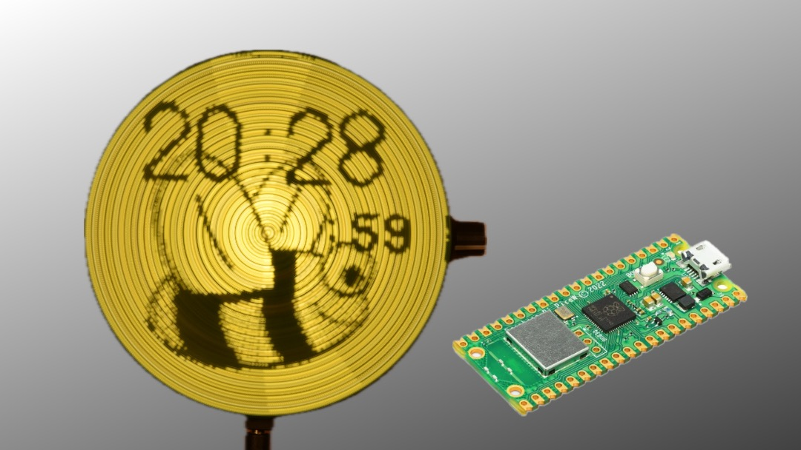
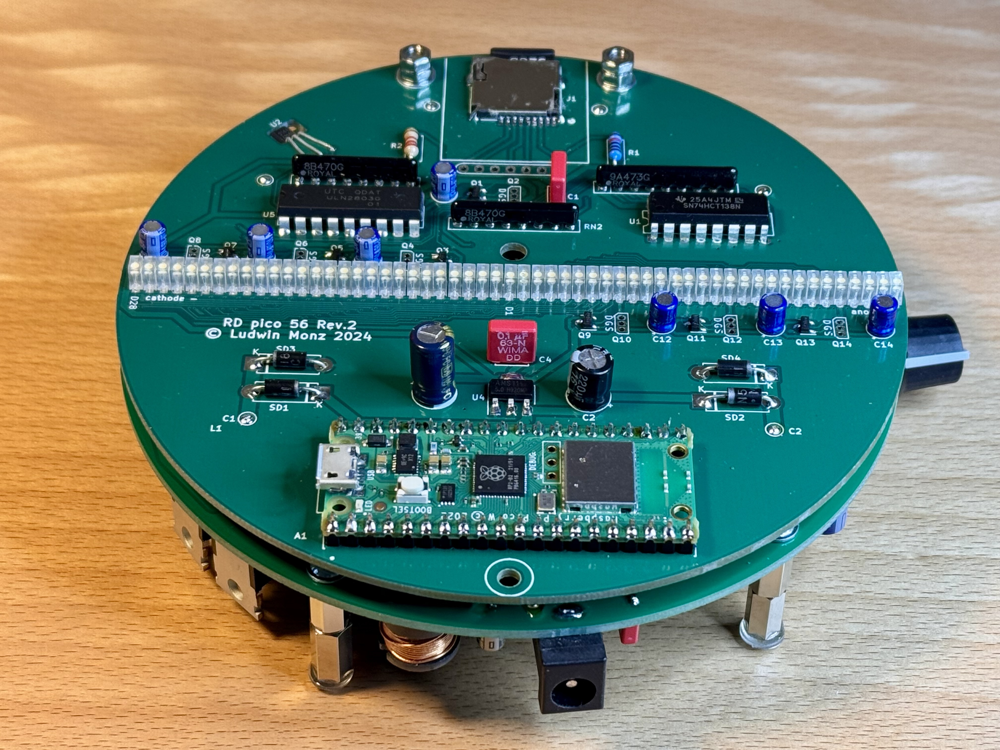

# Rotating Color Pico

## Abstract: 
 The Rotating Display Pico is a compact disc-sized device that rotates quietly using a CD motor. It features 56 white LEDs which are controlled by a raspberry pi pico. The device can display animated images as well as time and weather data sourced from the internet. It is wirelessly powered and controlled via a user-friendly web interface. The device uses off-the-shelf components and is easy to assemble.
 

 
  

## 1. Description of the device

 
  

